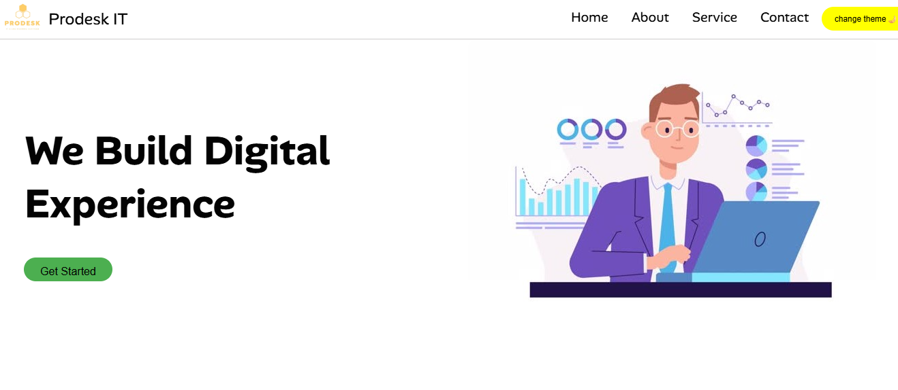

Prodesk IT Website

A simple and responsive IT company website built using HTML, CSS, and JavaScript.

Features
Responsive Navigation Bar
Hero Section with Call-to-Action
Services Section (SEO, Web Development, Marketing)
Contact Section with Icons
Theme Toggle Button (Light/Dark Mode)
Clean and Modern UI

 Technologies Used
HTML5
CSS3
JavaScript
Font Awesome (for icons)

screenshots-

[]
[]

website link host on netlify-
https://prodeskitmission1.netlify.app/

