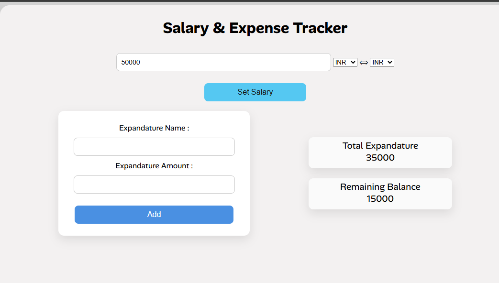
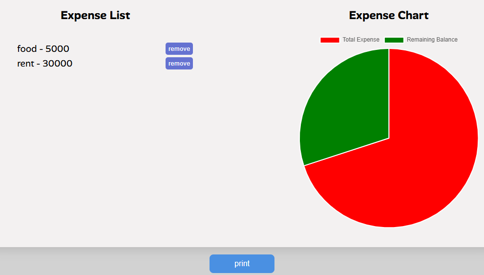

A simple web-based application to track salary, expenses, and remaining balance in real-time. It also visualizes expenses using charts and allows users to export data as a PDF.

-

- Add and set monthly salary
- Add multiple expenses with name and amount
- Real-time calculation of:
  - Total expenditure
  - Remaining balance
- Expense list display
- Pie chart visualization using Chart.js
- Currency selection (INR / USD)
- Export expense data as PDF using jsPDF
- Clean and simple UI

---

- HTML
- CSS
- JavaScript
- Chart.js (for data visualization)
- jsPDF (for PDF export)

---

---

1. User enters salary and selects currency
2. User adds expenses (name + amount)
3. Application:
   - Updates total expenses
   - Calculates remaining balance
   - Displays data in list format
   - Updates pie chart dynamically
4. User can export the expense report as a PDF

---

- Salary Input Section
- Expense Input Section
- Expense List
- Balance Summary
- Chart Visualization

---
screenshots-

[]
[]

deployed on netlify-
https://e-s-track.netlify.app/
